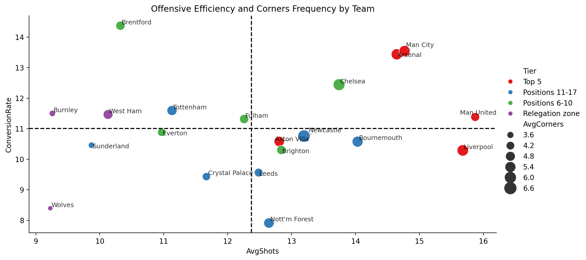
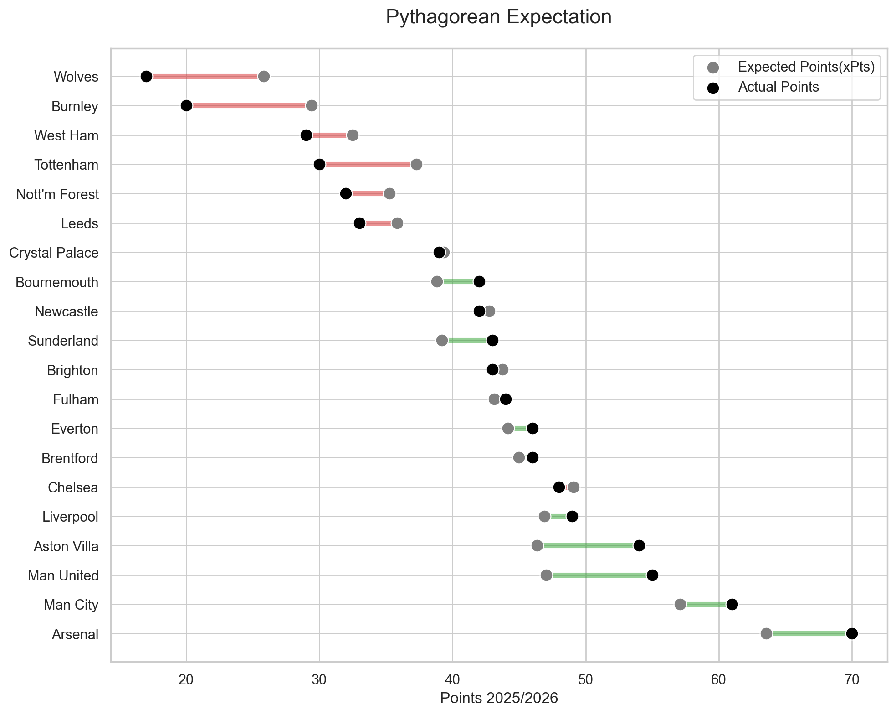
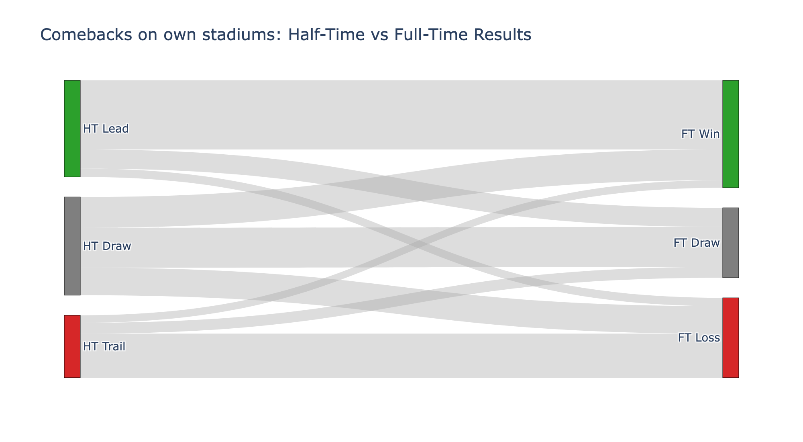
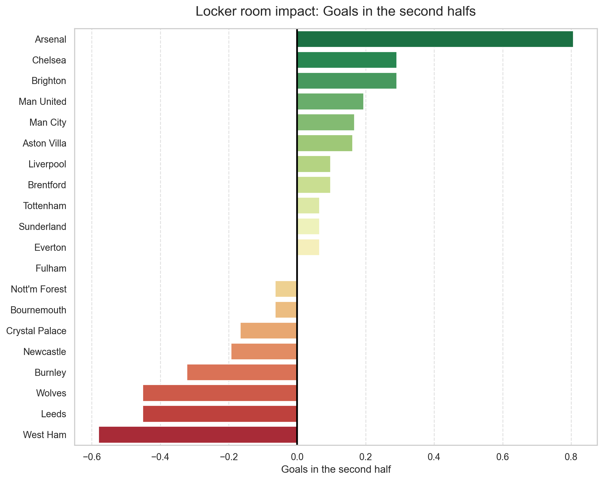

# Premier League 2025/2026 Live Analytics Pipeline

## Scope and Objective

This notebook analyzes the live 2025/2026 Premier League season, where teams can have different numbers of matches played.

Data is refreshed automatically every Tuesday via GitHub Actions.

Data source: https://www.football-data.co.uk/

## Data Ingestion

Load the source CSV into df_raw and inspect the first rows as a structural sanity check (columns, datatypes, missingness risk).

## Cleaning and Match Outcome Features

Keep rows complete for columns used downstream, then derive outcome features for modeling and flow analysis.

Created fields:
- HomePoints and AwayPoints from full-time score
- HalfTimeResult as the halftime match-state signal

## Team Mapping and Table Logic

Map clubs to stable TeamID, reshape matches to team-centric records, and build standings.

Two ranking views are kept on purpose:
- Position: official table (Points, GoalDifference, GoalsFor)
- PositionPPG: fair live-season ranking for unequal games played

Tier is assigned from PositionPPG for comparability in ongoing-season analysis.

## Standings Aggregation

Convert match rows into season team totals by combining home and away contributions, then calculate both total and per-game metrics used by later analyses.

## SQLite Persistence

Persist Matches, Teams, and Standings to SQLite so all SQL-based EDA runs on a consistent and reproducible snapshot.

## Offensive Profiling: Volume, Finishing, and Set-Piece Pressure

This chart combines three attacking indicators:
- AvgShots: chance volume per team-match
- ConversionRate: total goals divided by total shots
- AvgCorners: territorial pressure proxy

Because the season is live, per-match metrics are used to keep teams comparable despite unequal games played.



### So What?
- Teams above both reference lines pair shot volume with efficient finishing
- High volume but low conversion suggests shot quality or finishing issues
- Low volume but high conversion often indicates selective, transition-led attacks

## Pythagorean Expectation: Expected vs Actual Points

This model estimates expected points (xPts) from goals for/against, then compares that estimate with actual points.

In this version, draw probability is team-specific and shrinked toward league average to reduce small-sample noise in a live season.



### So What?
- Positive Luck: points overperformance versus goal-based expectation
- Negative Luck: potential underperformance versus underlying process
- Useful for separating table position from true performance trend

## Halftime to Fulltime Flow (Home Matches)

This Sankey aggregates league-wide transitions from halftime state to fulltime result in home matches.

State mapping:
- HalfTimeResult: 1 (home lead), 0 (draw), -1 (home trail)
- HomePoints: 3 (home win), 1 (draw), 0 (home loss)



### So What?
- HT Draw is usually the highest-volatility state
- HT Lead and HT Trail are relatively sticky
- For tactical coaching insights, replicate this flow at single-team level

## Locker Room Impact: Second-Half Net Goal Differential

This metric isolates post-halftime performance by averaging each team's net second-half goal difference per match.

SQL logic: compute net second-half differential from home and away perspectives, union both, then average by team.



### So What?
- Positive values indicate stronger halftime adaptation and game management
- Negative values may signal fitness drop-off, tactical rigidity, or bench-impact issues
- Useful for scouting coaching profile and in-game adjustment quality

## Stack

- Python: pandas, numpy
- SQLAlchemy + SQLite
- matplotlib, seaborn
- plotly (graph_objects) + plotly offline
- adjustText
- kaleido

## How to Run

1. Activate a Python environment.
2. Install dependencies:

```bash
pip install -r requirements.txt
```

3. Run pipeline.ipynb from the first cell to the last.

## Automated Weekly Update

- A GitHub Actions workflow runs every Tuesday at 08:00 UTC.
- It executes pipeline.ipynb and commits updated notebook output when new data is available.
- You can also trigger the workflow manually using workflow_dispatch.

## Author

Tymoteusz Drewniak
